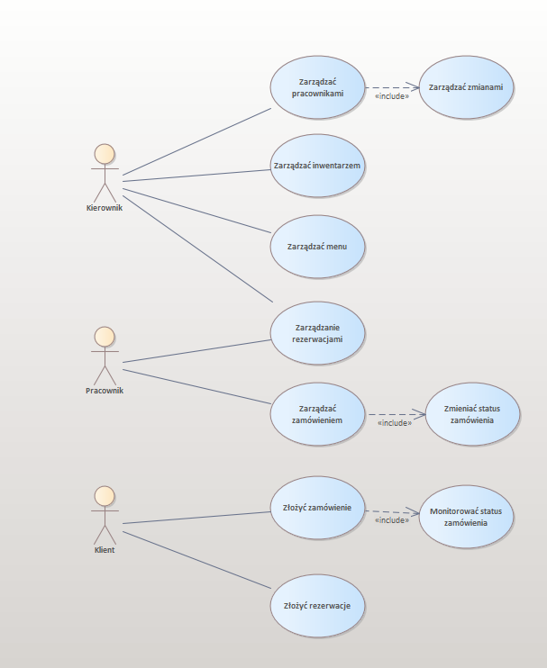

# Aplikacja webowa ułatwiająca prowadzenie kawiarni

## Diagram przypadków użycia

## Założenia projektu

1. Ułatwienie zarządzanie kawiarnią (Strona internetowa)

   1. System logowania

      1. Strona logowania
      2. Strona rejestracji
      3. Walidacja danych
      4. Przesłanie danych do strony serwerowej (backend)

         1. Odebranie danych
         2. Rejestracja - zapis danych do bazy danych
         3. Logowanie - sprawdzenie czy dany uzytkownik istnieje
         4. Przesłanie informacji zwrotnej do uzytkownika

   2. System rezerwacji stolików/lokalu

      1. Strona rezerwacji z formularzem
      2. Walidacja danych z formularzu
      3. Przesłanie danych do strony serwerowej (backend)

         1. Odebranie danych
         2. Zapis do bazy danych

      4. Strona zarządzająca systemem rezerwacji tzw. panel admina/pracownika

         1. Ustawienie statusu
            ???

2. Techologie

   1. Frontend - React z typescriptem
   2. Backend - Node.js
   3. Baza danych - MySQL
   4. System kontroli wersji - github

3. Czas wykonania ??.0?.2024
